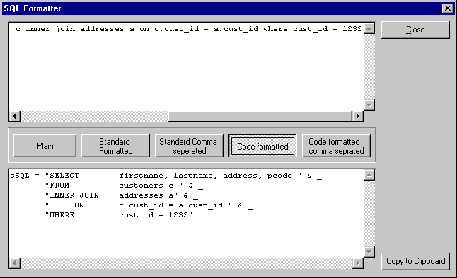



## Good SQL Formatter Add\-in

### Description

This SQL formatter Add In formats your SQL in various formats
 
### More Info
 
Just compile, register and try this tool!

The format function in the form can easily be extented or used in other apps

             |
---                |---
**Submitted On**   |2002-03-19 11:34:26
**By**             |[Oofus](https://github.com/Planet-Source-Code/PSCIndex/blob/master/ByAuthor/oofus.md)
**Level**          |Beginner
**User Rating**    |4.7 (33 globes from 7 users)
**Compatibility**  |VB 6\.0
**Category**       |[String Manipulation](https://github.com/Planet-Source-Code/PSCIndex/blob/master/ByCategory/string-manipulation__1-5.md)
**World**          |[Visual Basic](https://github.com/Planet-Source-Code/PSCIndex/blob/master/ByWorld/visual-basic.md)
**Archive File**   |[Good\_SQL\_F633253192002\.zip](https://github.com/Planet-Source-Code/oofus-good-sql-formatter-add-in__1-32822/archive/master.zip)

